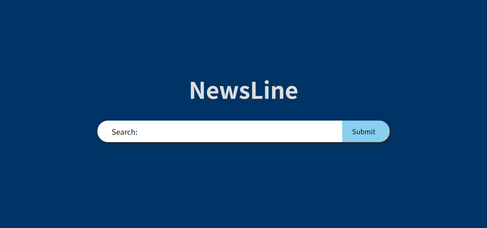
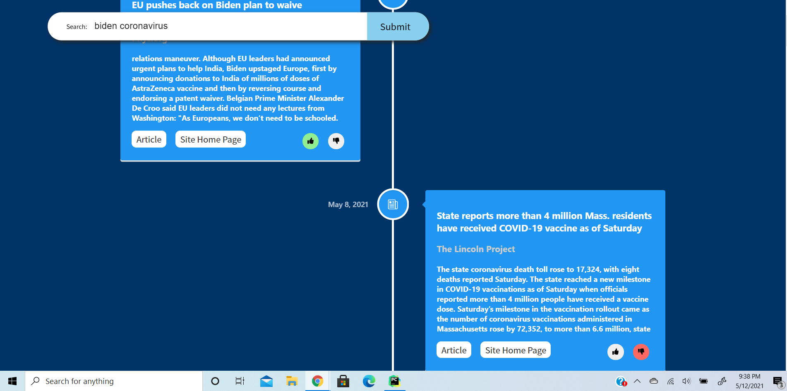

# Final Project for Information Retrieval and Web Agents (601.666)

### How to run this code

To run this code for the first time, you must have Node.js
and Python 3.9 installed. To install Node.js, please visit [this link](https://nodejs.org/en/download/).
To download Python 3.9, please visit [this link](https://www.python.org/downloads/).

Once you have those two things, clone this repository in any folder by typing 

`git clone https://github.com/agking10/IR_FinalProject.git`

from the command line.

Next, navigate to this folder by typing `cd IR_FinalProject`

To create a virtual environment, type `python -m venv venv`

Then type `source ./venv/bin/activate`

To install the required python packages, use the command 
`pip3 install -r requirements.txt`

Now, everything is set up to run the REST API. To
start the server, run the command `python backend/api.py --reset_db --reset_cache`.
This may take a few seconds to start because the script needs to
populate the document database. If you have run the script in the past 
and know that the databases are populated,
you can avoid recreating the databases by removing the flags `--reset_db` 
and `--reset_cache`.

Once the backend is running, open another terminal 
and navigate to the project root folder (`IR_FinalProject`).
Then, navigate to the webpage folder with `cd webpage`.
To install the required packages, type `npm install` into the 
command line. Once all packages are installed, type `npm start` into
the command line. This will start a development server and you can 
play with the application.

#### A demo of this application is available [here](https://youtu.be/Xso2Z3c4dII)

There were 432 news source candidates in the original dump from AllSides Media Bias Ratings, but only 358 news sources
were actually valid. The [source stub](media_bias_table.html) was saved from
[here](https://www.allsides.com/media-bias/media-bias-ratings?field_featured_bias_rating_value=All&field_news_source_type_tid%5B2%5D=2&field_news_bias_nid_1%5B1%5D=1&field_news_bias_nid_1%5B2%5D=2&field_news_bias_nid_1%5B3%5D=3&title=)
on May 6, 2021. We scraped 39,278 stories, which can be found in Pickle format [here](stories.pickle).
